# GCP NYC Taxi Data Lake

## Overview

This project outlines a robust and scalable data pipeline for ingesting, processing, and analyzing NYC Taxi data on Google Cloud Platform (GCP). Designed with best practices for data lakes, the pipeline automates monthly data collection, efficient storage in Parquet format, and transformation into curated datasets for advanced analytics and business intelligence using Looker Studio. This project demonstrates proficiency in cloud data engineering, Big Data processing, and data visualization.

## Setup and Prerequisites

Before deploying and running this pipeline, ensure you have the following in place:

*   **Google Cloud Platform (GCP) Project:** A GCP project with billing enabled.
*   **`gcloud` CLI:** The Google Cloud SDK `gcloud` command-line tool installed and configured. Ensure you are authenticated and have set your default project.
*   **Terraform (Optional but Recommended):** If you plan to manage infrastructure as code, Terraform should be installed. (Note: Terraform configurations are not included in this README but are a recommended practice).
*   **Python 3.x and `pip`:** For managing Python dependencies and running any local scripts.
*   **GSUtil:** The `gsutil` command-line tool, typically installed with the `gcloud` SDK, for interacting with Cloud Storage.
*   **BQ CLI:** The `bq` command-line tool, also part of the `gcloud` SDK, for interacting with BigQuery.

**GCP Project Configuration Steps:**

1.  **Set your GCP Project ID:**
    Replace `your-gcp-project-id` with your actual GCP project ID.
    ```bash
    gcloud config set project your-gcp-project-id
    ```
2.  **Enable Required GCP APIs:**
    This pipeline utilizes several GCP services. Ensure the following APIs are enabled in your project:
    *   Cloud Functions API
    *   Cloud Scheduler API
    *   Cloud Pub/Sub API
    *   Cloud Storage API
    *   BigQuery API
    *   BigQuery Connection API
    *   BigQuery Data Transfer API
    *   BigQuery Migration API
    *   BigQuery Reservation API
    *   BigQuery Storage API
    *   Cloud Logging API
    *   Cloud Monitoring API
    *   Cloud Resource Manager API

    You can enable them via the GCP Console or using the `gcloud` command:
    ```bash
    gcloud services enable cloudfunctions.googleapis.com \
                         cloudscheduler.googleapis.com \
                         pubsub.googleapis.com \
                         storage.googleapis.com \
                         bigquery.googleapis.com
    ```
    **Screenshot:** Verification of enabled APIs in the GCP Console.
    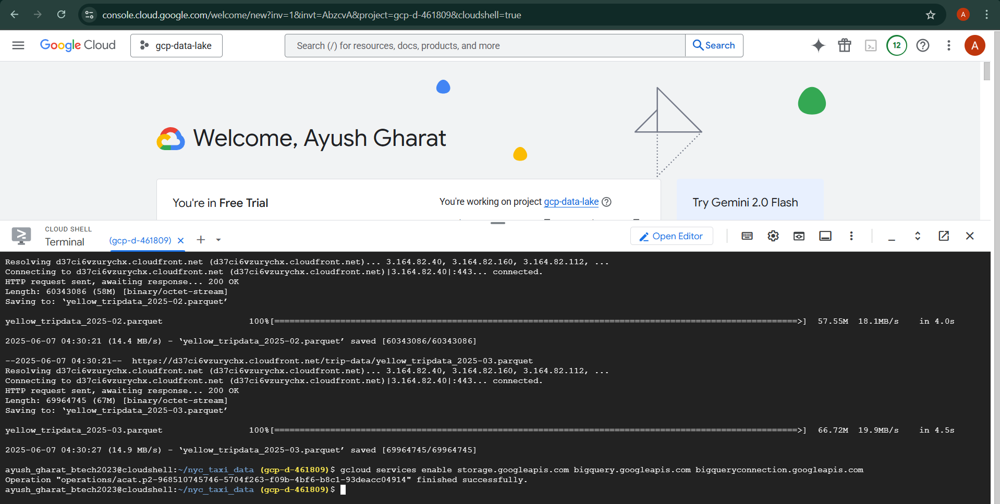

## Pipeline Components

This section provides a detailed breakdown of each component in the data pipeline, including its role, relevant code snippets from the project, execution commands, and illustrative screenshots.

### 1. Monthly Cron Job (Cloud Scheduler & Cloud Function)

**Explanation:** The data ingestion process is orchestrated by a Google Cloud Scheduler job, configured to run monthly. This scheduler job sends an HTTP request to trigger a Google Cloud Function, `monthly_trigger`. The Cloud Function's primary role is to compute the current year and month and then publish this information as a message to a designated Pub/Sub topic (`trigger-nyc-pipeline`). This event-driven approach ensures the pipeline is automatically initiated each month, fetching the latest taxi data.

**Code (`data/monthly_scheduler_trigger/main.py`):**
This Python script defines the Cloud Function that computes and publishes the year/month to Pub/Sub.
```python
import datetime
import json
from google.cloud import pubsub_v1

PROJECT_ID = "gcp-d-461809" # IMPORTANT: Replace with your actual GCP Project ID
TOPIC_ID = "trigger-nyc-pipeline" # The Pub/Sub topic that triggers the main ingestion pipeline

def monthly_trigger(request):
    """
    Cloud Function triggered by Cloud Scheduler. Computes the current year and month,
    and publishes them to a Pub/Sub topic.
    """
    now = datetime.datetime.now()
    year = now.strftime("%Y") # e.g., "2023"
    month = now.strftime("%m") # e.g., "10"

    message = json.dumps({"year": year, "month": month})
    publisher = pubsub_v1.PublisherClient()
    topic_path = publisher.topic_path(PROJECT_ID, TOPIC_ID)

    # Publish the year and month as a JSON payload to the Pub/Sub topic
    publisher.publish(topic_path, data=message.encode("utf-8"))

    return f"Published message for {year}-{month}", 200
```

**Deployment Command (Cloud Function `monthly-trigger`):**
Deploy the `monthly_trigger` Cloud Function, making it callable via HTTP.
```bash
gcloud functions deploy monthly-trigger \
    --runtime python39 \
    --trigger-http \
    --entry-point monthly_trigger \
    --region us-central1 \
    --allow-unauthenticated # Or configure appropriate authentication for production
```
*Note the `--trigger-http` flag and `--allow-unauthenticated` for simpler testing. For production, ensure proper authentication (e.g., IAM roles) is configured.*

**Deployment Command (Cloud Scheduler Job `monthly-taxi-data-trigger`):**
Create the Cloud Scheduler job to trigger the deployed Cloud Function.
```bash
gcloud scheduler jobs create http monthly-taxi-data-trigger \
    --schedule "0 0 1 * *" \
    --uri="$(gcloud functions describe monthly-trigger --region us-central1 --format='value(httpsTrigger.url)')" \
    --http-method=POST \
    --oauth-service-account-email="your-service-account@your-gcp-project-id.iam.gserviceaccount.com" \
    --time-zone "America/New_York" \
    --message-body "{}"
```
*Replace `your-service-account@your-gcp-project-id.iam.gserviceaccount.com` with a service account that has `roles/cloudfunctions.invoker` permission on the `monthly-trigger` Cloud Function and `roles/pubsub.publisher` on the `trigger-nyc-pipeline` topic.*

**Screenshot:** A screenshot of your Cloud Scheduler job configuration in the GCP Console.


### 2. Compute Year, Month (Part of Cloud Function Logic)

**Explanation:** This crucial step is embedded within the `monthly_trigger` Cloud Function (as shown in the code above). It leverages Python's `datetime` module to dynamically determine the current year and month. This extracted information is then encapsulated within the Pub/Sub message payload. This dynamic year-month computation is fundamental for partitioning the raw data in Google Cloud Storage and BigQuery, which significantly optimizes query performance and enhances data organization within the data lake.

**Code:** (Refer to the `monthly_trigger` function in `data/monthly_scheduler_trigger/main.py` provided in Section 1 for the exact implementation of year and month computation.)

**Screenshot:** A screenshot highlighting the relevant code block within the Cloud Function's source code viewer in the GCP Console, or logs showing the extracted year/month.


### 3. Streaming Topic (Google Cloud Pub/Sub)

**Explanation:** Google Cloud Pub/Sub acts as a highly scalable, asynchronous messaging service at the heart of this pipeline. Two primary topics are utilized:
*   `trigger-nyc-pipeline`: This topic receives messages from the `monthly_trigger` Cloud Function, signaling the start of a new monthly data ingestion cycle.
*   `nyc-taxi-data-stream`: This topic (though not explicitly shown in `monthly_scheduler_trigger/main.py` but implied by the overall flow) would typically be the topic subscribed to by the subsequent data ingestion Cloud Function (`data/ingestion_pipeline/main.py`), allowing it to react to new data availability events.

Pub/Sub decouples the pipeline components, ensuring resilience and allowing for flexible scaling of producers and consumers.

**Example Commands (Create Pub/Sub Topics):**
```bash
gcloud pubsub topics create trigger-nyc-pipeline
gcloud pubsub topics create nyc-taxi-data-stream
```

**Screenshot:** A screenshot showcasing the created Pub/Sub topics within the GCP Console.


### 4. Downloads .parquet (Data Ingestion Cloud Function)

**Explanation:** This is a critical data ingestion step implemented as a Google Cloud Function. This function subscribes to a Pub/Sub topic (e.g., `nyc-taxi-data-stream`). Upon receiving a message (which contains the year and month information from the `monthly_trigger`), the function dynamically constructs a URL to download the corresponding NYC Taxi trip data in Parquet format from a public source (e.g., `https://d37ci6vzurychx.cloudfront.net/trip-data/`). After a successful download, the function uploads the Parquet file directly to the Google Cloud Storage (GCS) "Raw Zone." The use of Parquet, a columnar storage format, is crucial for optimizing subsequent analytical queries and reducing storage costs due to its efficient compression.

**Code (`data/ingestion_pipeline/main.py`):**
This Python script defines the Cloud Function responsible for downloading and uploading Parquet files.
```python
import base64
import json
import requests
from flask import Flask, request
from google.cloud import storage

app = Flask(__name__)
storage_client = storage.Client()

BUCKET_NAME = "nyc-taxi-datalake-project" # IMPORTANT: Ensure this matches your GCS Raw Zone bucket name

@app.route("/", methods=["POST"])
def pubsub_trigger():
    """
    Cloud Function triggered by a Pub/Sub message.
    Downloads a Parquet file for a specific year and month and uploads it to GCS.
    """
    data = request.get_json() # Get the JSON payload from the incoming request
    if "message" not in data:
        print("Invalid Pub/Sub format: 'message' key missing.")
        return "Invalid Pub/Sub format", 400

    # Decode the base64-encoded Pub/Sub message data
    pubsub_message = base64.b64decode(data["message"]["data"]).decode("utf-8")
    # Parse the decoded Pub/Sub message string as a JSON object
    params = json.loads(pubsub_message)

    year = params.get("year", "2025") # Default year if not provided
    month = params.get("month", "01") # Default month if not provided
    
    file_name = f"yellow_tripdata_{year}-{month}.parquet" # Construct file name
    url = f"https://d37ci6vzurychx.cloudfront.net/trip-data/{file_name}" # Construct download URL

    print(f"Attempting to download from: {url}")
    
    response = requests.get(url) # Download the file
    
    if response.status_code != 200:
        print(f"Failed to fetch data from: {url}. Status code: {response.status_code}")
        return f"Failed to fetch: {url} (Status: {response.status_code})", 500

    # Define the full path where the file will be stored in the GCS bucket
    blob_path = f"nyc-taxi-datalake-project/raw/{file_name}" # Stores in a 'raw' subfolder
    
    bucket = storage_client.bucket(BUCKET_NAME) # Get reference to the GCS bucket
    blob = bucket.blob(blob_path) # Create a new blob (object) in the bucket
    
    blob.upload_from_string(response.content) # Upload the downloaded content

    print(f"Successfully uploaded to GCS: {blob_path}")
    
    return f"Done: {file_name}", 200
```

**Deployment Command (Cloud Function `download-and-upload-parquet`):**
Deploy the ingestion pipeline Cloud Function, triggered by the `nyc-taxi-data-stream` Pub/Sub topic.
```bash
gcloud functions deploy download-and-upload-parquet \
    --runtime python39 \
    --trigger-topic nyc-taxi-data-stream \
    --entry-point pubsub_trigger \
    --region us-central1 \
    --memory 256MB \
    --timeout 300s \
    --service-account="your-service-account@your-gcp-project-id.iam.gserviceaccount.com"
```
*Ensure the specified service account has `roles/storage.objectAdmin` or equivalent permissions to write objects to the `nyc-taxi-datalake-project` GCS bucket.*

**Screenshot:** A screenshot illustrating the successful execution of this Cloud Function, perhaps from Cloud Logging or a visual representation of the data flow.


### 5. GCS Raw Zone (Google Cloud Storage Bucket)

**Explanation:** The `nyc-taxi-datalake-project` Google Cloud Storage bucket serves as the foundational "Raw Zone" of the data lake. It is the primary landing area for all raw Parquet files downloaded by the ingestion pipeline. This bucket is configured for regional storage (e.g., `us-central1`) to balance durability and cost-effectiveness. The raw zone is critical for maintaining an immutable, versioned record of all ingested data, providing a single source of truth before any transformations occur. This design supports re-processing capabilities and adheres to data lake principles.

**Example Command (Create GCS Bucket):**
```bash
gsutil mb -l us-central1 gs://nyc-taxi-datalake-project
```
*Replace `us-central1` with the GCP region where you want to store your data.*

**Screenshot:** A screenshot of the `nyc-taxi-datalake-project` GCS bucket in the GCP Console, showing its configuration and some of the uploaded raw Parquet files.


### 6. External Table (BigQuery)

**Explanation:** An external table in Google BigQuery provides a powerful way to query the raw Parquet files directly from the GCS Raw Zone without physically loading the data into BigQuery's managed storage. This approach offers significant advantages:
*   **Schema Flexibility:** BigQuery can often infer the schema directly from Parquet files, reducing the need for explicit schema definitions.
*   **Cost-Efficiency:** Data is not duplicated, saving storage costs.
*   **Ad-Hoc Analysis:** Enables immediate SQL access to raw data for exploration and debugging.

This external table (`external_nyc_taxi_data`) serves as the first layer of data accessibility within BigQuery, acting as a bridge between the raw data in GCS and the structured query environment.

**Code (`sql/01-creating-external-table.sql`):**
This SQL script defines the external table in BigQuery.
```sql
CREATE EXTERNAL TABLE IF NOT EXISTS `your_project.raw_dataset.external_nyc_taxi_data`
OPTIONS (
  format = 'PARQUET',
  uris = ['gs://nyc-taxi-datalake-project/raw/*.parquet']
);
```
*IMPORTANT: Replace `your_project` and `raw_dataset` with your actual GCP project ID and the BigQuery dataset where you intend to create this table.*

**Execution Command (BigQuery CLI):**
Execute the SQL script to create the external table.
```bash
bq query --use_legacy_sql=false --project_id=your-gcp-project-id < sql/01-creating-external-table.sql
```
*Remember to replace `your-gcp-project-id`.*

**Screenshots:** Visual confirmation of the external table creation and its properties in the BigQuery UI.
*   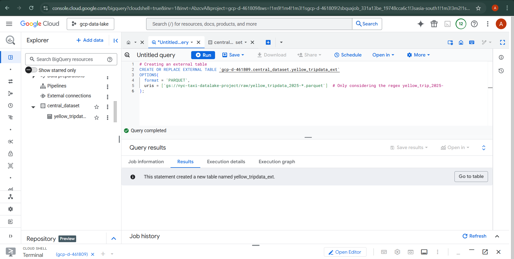
*   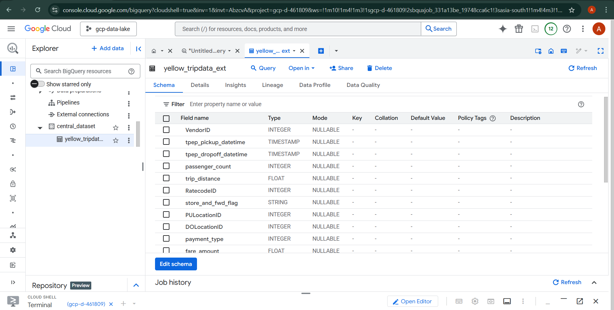
*   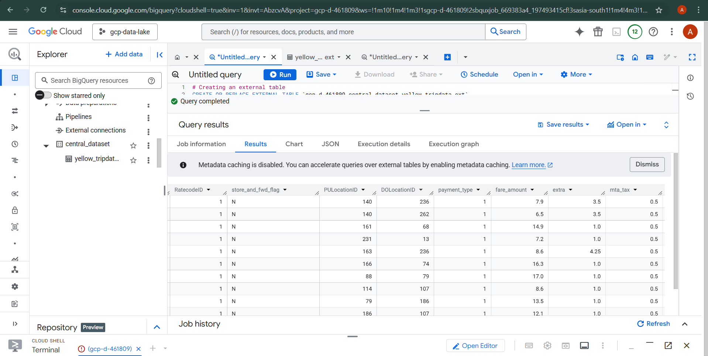

### 7. Curated Table (BigQuery)

**Explanation:** The curated table (`nyc_taxi_curated_data`) in BigQuery represents the refined, cleaned, and transformed version of the raw data. This table is optimized for performance, ease of consumption by business users, and efficient reporting and dashboarding. The curation process typically involves:
*   **Data Cleaning:** Handling nulls, inconsistencies, and erroneous entries.
*   **Data Enrichment:** Adding derived fields or joining with other reference data.
*   **Normalization/Aggregation:** Structuring the data for specific analytical use cases.

This curated layer provides a reliable, high-quality dataset for direct consumption by BI tools and data scientists, ensuring consistency and accuracy in insights.

**Code (`sql/02-creating-curated-table.sql`):**
This SQL script defines the transformations to create the curated table.
```sql
CREATE OR REPLACE TABLE `your_project.curated_dataset.nyc_taxi_curated_data` AS
SELECT
  year,
  month,
  CAST(tpep_pickup_datetime AS TIMESTAMP) AS pickup_datetime,
  CAST(tpep_dropoff_datetime AS TIMESTAMP) AS dropoff_datetime,
  passenger_count,
  trip_distance,
  pulocationid,
  dolocationid,
  ratecodeid,
  store_and_fwd_flag,
  payment_type,
  fare_amount,
  extra,
  mta_tax,
  tip_amount,
  tolls_amount,
  improvement_surcharge,
  total_amount,
  congestion_surcharge,
  airport_fee
FROM
  `your_project.raw_dataset.external_nyc_taxi_data`
WHERE
  trip_distance > 0 -- Example: Filter out invalid trip distances
  AND passenger_count > 0; -- Example: Filter out trips with no passengers
```
*IMPORTANT: Replace `your_project`, `curated_dataset`, and `raw_dataset` with your actual GCP project ID and BigQuery datasets.*

**Execution Command (BigQuery CLI):**
Execute the SQL script to create or update the curated table.
```bash
bq query --use_legacy_sql=false --project_id=your-gcp-project-id < sql/02-creating-curated-table.sql
```

**Screenshots:** Visual proof of the curated table schema and a sample of the cleaned data in the BigQuery UI.
*   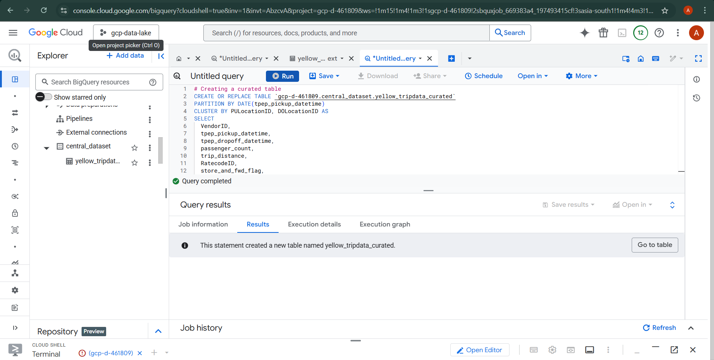
*   

### 8. Looker Studio Dashboard

**Explanation:** The curated BigQuery table (`nyc_taxi_curated_data`) serves as the definitive data source for a comprehensive and interactive Looker Studio (formerly Google Data Studio) dashboard. This dashboard provides key business insights through various visualizations, including:
*   **Trip Volume Analysis:** Trends in daily/monthly trip counts.
*   **Fare and Revenue Breakdown:** Analysis of fare components and revenue by payment type.
*   **Vendor Performance:** Comparative analysis of different taxi vendors.
*   **Geospatial Insights:** Pickup and dropoff location statistics.
*   **ML Integration:** (If applicable) Visualization of ML model predictions or evaluations.

This final layer of the data lake transforms raw data into actionable business intelligence, empowering stakeholders to make data-driven decisions without requiring SQL expertise.

**Link to Dashboard:** [NYC Taxi Data Analysis Dashboard](https://lookerstudio.google.com/reporting/90336218-d404-49a3-9490-4f1463042457)

**Screenshots:** A gallery of screenshots showcasing the dashboard's capabilities and various analytical views.
*   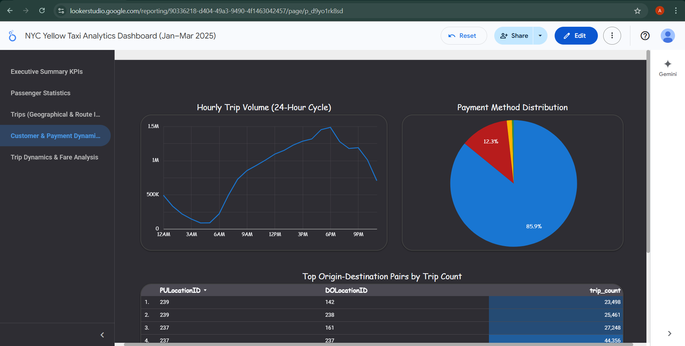
*   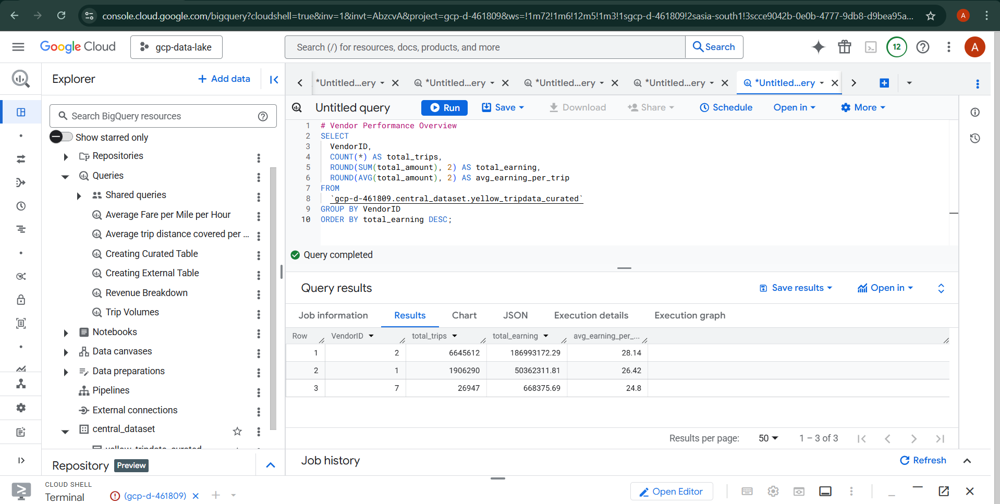
*   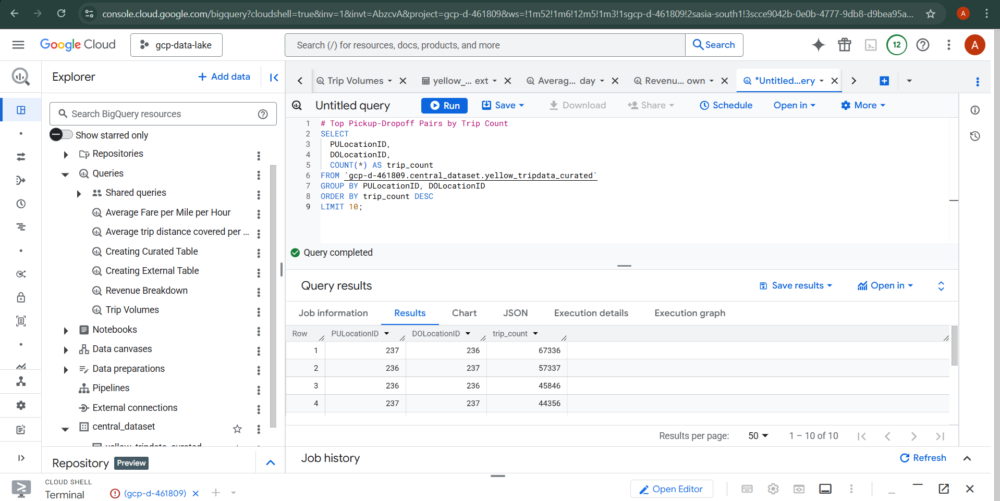
*   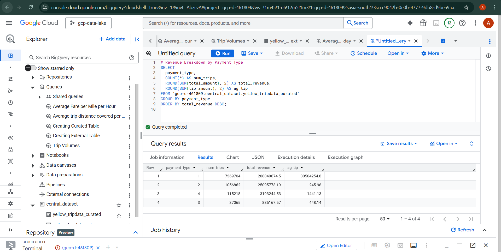
*   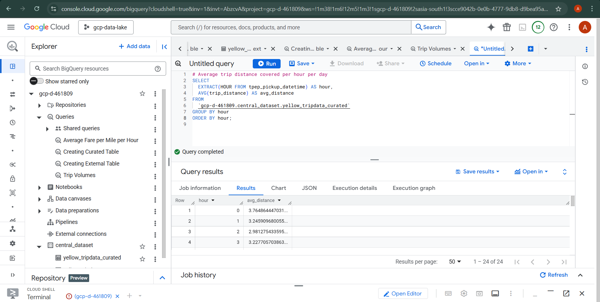
*   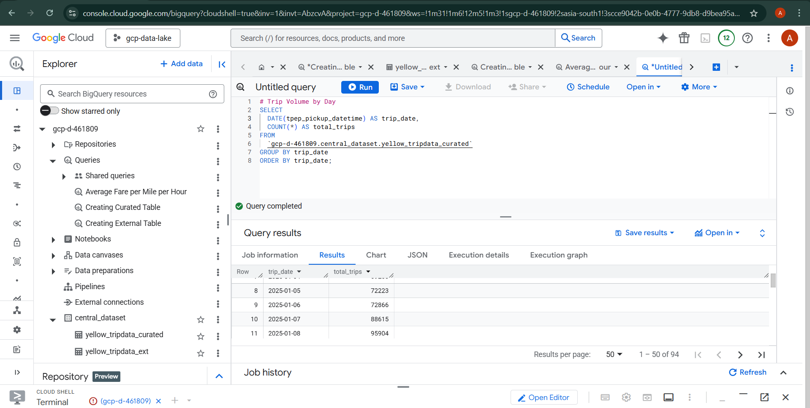
*   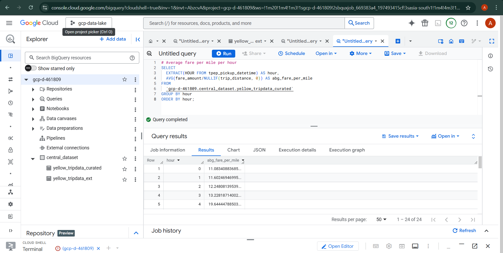
*   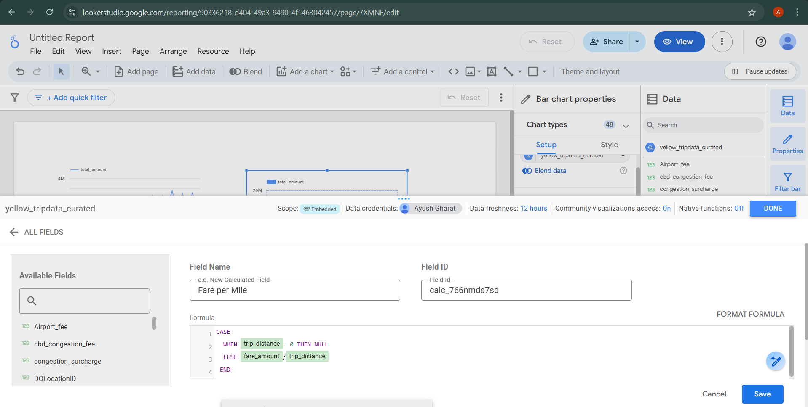

## Machine Learning Models (Optional Advanced Analytics)

**Explanation:** This project includes advanced analytical capabilities demonstrated through SQL scripts for creating machine learning models directly within BigQuery ML. This showcases the ability to leverage existing data for predictive analytics. The models can be trained for various predictions, such as estimating taxi fares, predicting trip durations, or classifying pickup zones based on historical data. This integration of ML directly within BigQuery eliminates the need for data movement to separate ML platforms, simplifying the MLOps pipeline.

**Example Code (Conceptual from `models/fare-prediction-model.sql`):**
This illustrates how a linear regression model might be created for fare prediction.
```sql
-- Example: Creating a fare prediction model using BigQuery ML
CREATE OR REPLACE MODEL `your_project.ml_dataset.fare_prediction_model`
OPTIONS(
  model_type='LINEAR_REG',
  input_label_cols=['total_amount'] -- The target variable to predict
) AS
SELECT
  trip_distance,
  passenger_count,
  fare_amount,
  -- Include other relevant features for prediction
  total_amount
FROM
  `your_project.curated_dataset.nyc_taxi_curated_data`
WHERE
  total_amount IS NOT NULL; -- Ensure no nulls in target variable
```

**Relevant SQL Model Files in `models/`:**
*   `models/pickup-zone-classifier-view.sql`: SQL view for pickup zone classification.
*   `models/duration-prediction-view.sql`: SQL view for duration prediction.
*   `models/fare-prediction-view.sql`: SQL view for fare prediction.
*   `models/pickup-zone-classifier-model.sql`: SQL script to create a pickup zone classifier model.
*   `models/duration-prediction-model.sql`: SQL script to create a duration prediction model.
*   `models/fare-prediction-model.sql`: SQL script to create a fare prediction model.

**Screenshots:** Visuals related to the ML pipeline and model evaluation.
*   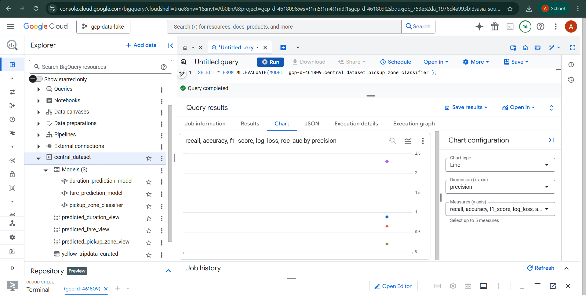
*   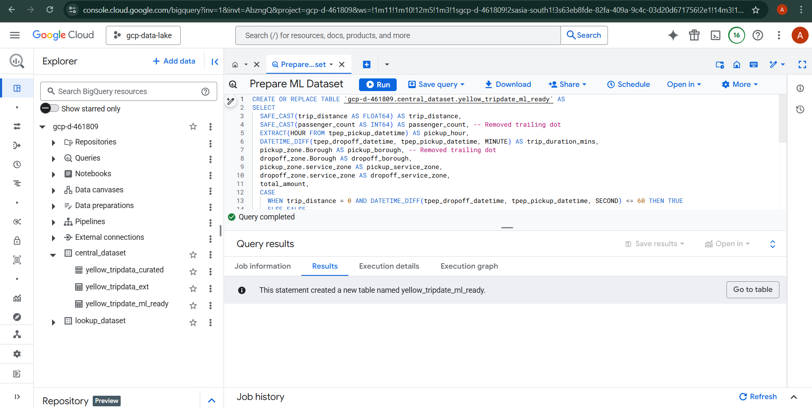


## Analytical Queries (Ad-Hoc and Reporting)

**Explanation:** The `analytics/` directory houses a collection of SQL queries designed for various analytical purposes on the NYC Taxi dataset. These queries leverage the `nyc_taxi_curated_data` table to extract specific insights and can be used for:
*   **Ad-hoc Analysis:** Quickly answer specific business questions.
*   **Reporting:** Generate data for recurring reports.
*   **Dashboarding Foundations:** Serve as building blocks for more complex dashboards or interactive reports.

These queries demonstrate the flexibility and power of BigQuery for in-depth data exploration.

**Relevant SQL Query Files in `analytics/`:**
*   `analytics/vendor-performance-analysis.sql`
*   `analytics/trip-volumes.sql`
*   `analytics/trip-duration-distribution.sql`
*   `analytics/top-pickup-dropoff-pairs.sql`
*   `analytics/tip-percentage-distribution.sql`
*   `analytics/rush-hour-analysis.sql`
*   `analytics/revenue-breakdown.sql`
*   `analytics/location-to-location-revenue-matrix.sql`
*   `analytics/daily-average-fare-per-mile.sql`
*   `analytics/trip-distance-covered-per-hour-per-day.sql`
*   `analytics/average-fare-per-mile.sql`

## How to Run/Deploy This Data Lake Pipeline

Follow these steps to set up and deploy the GCP NYC Taxi Data Lake pipeline:

1.  **GCP Project and API Setup**:
    *   Create a new GCP project or use an existing one.
    *   Set your project ID: `gcloud config set project your-gcp-project-id`.
    *   Enable all necessary APIs as detailed in the [Setup and Prerequisites](#setup-and-prerequisites) section.
    *   **Screenshot:** 

2.  **Google Cloud Storage (GCS) Bucket Creation**:
    *   Create the `nyc-taxi-datalake-project` GCS bucket, which will serve as your raw data zone.
        ```bash
        gsutil mb -l us-central1 gs://nyc-taxi-datalake-project
        ```
    *   **Screenshot:** 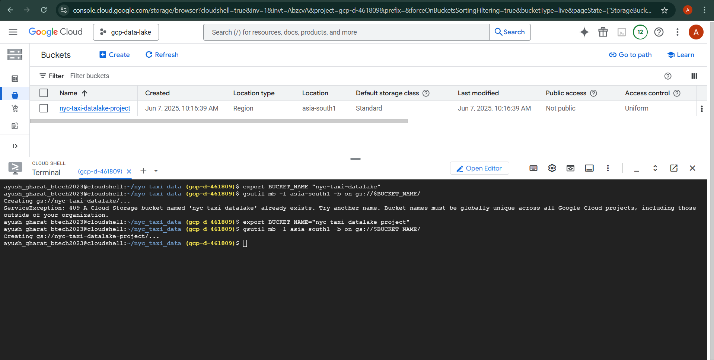

3.  **Pub/Sub Topic Creation**:
    *   Create the two Pub/Sub topics:
        ```bash
        gcloud pubsub topics create trigger-nyc-pipeline
        gcloud pubsub topics create nyc-taxi-data-stream
        ```

4.  **Deploy Monthly Trigger Cloud Function (`monthly-trigger`)**:
    *   Navigate to the `data/monthly_scheduler_trigger/` directory.
    *   Deploy the Cloud Function as per the command in [Section 1](#1-monthly-cron-job-cloud-scheduler--cloud-function).

5.  **Deploy Ingestion Pipeline Cloud Function (`download-and-upload-parquet`)**:
    *   Navigate to the `data/ingestion_pipeline/` directory.
    *   Deploy this Cloud Function, ensuring it subscribes to `nyc-taxi-data-stream`, as detailed in [Section 4](#4-downloads-parquet-data-ingestion-cloud-function).
    *   **Screenshot (Conceptual):** While not directly related to deployment, `screenshots/03-executing-import-job.png` could potentially be re-purposed to show a conceptual import or function execution.

6.  **Set Up Cloud Scheduler Job**:
    *   Create the Cloud Scheduler job to trigger your `monthly-trigger` Cloud Function monthly, following the command provided in [Section 1](#1-monthly-cron-job-cloud-scheduler--cloud-function).

7.  **BigQuery Dataset and Table Creation**:
    *   Create the necessary BigQuery datasets (e.g., `raw_dataset`, `curated_dataset`, `ml_dataset`) in your project.
    *   **Screenshot:** 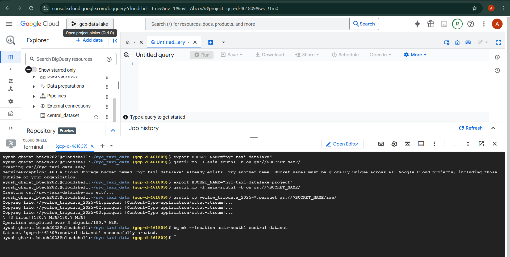
    *   Execute the SQL script for the external table (`sql/01-creating-external-table.sql`) using the `bq query` command from [Section 6](#6-external-table-bigquery).
    *   **Screenshots:**
        *   
        *   
        *   
    *   Execute the SQL script for the curated table (`sql/02-creating-curated-table.sql`) using the `bq query` command from [Section 7](#7-curated-table-bigquery).
    *   **Screenshot:** 
    *   (Optional) Run the SQL scripts in the `models/` directory to create BigQuery ML models for advanced analytics.

8.  **Looker Studio Dashboard Integration**:
    *   Open the [NYC Taxi Data Analysis Dashboard](https://lookerstudio.google.com/reporting/90336218-d404-49a3-9490-4f1463042457) link.
    *   If prompted, connect the dashboard to your `your_project.curated_dataset.nyc_taxi_curated_data` BigQuery table.
    *   Explore and customize the visualizations.

## Future Enhancements

*   **Data Validation and Quality:** Implement robust data validation and quality checks within the ingestion and curation processes using tools like Dataform or custom Cloud Functions.
*   **Real-time Processing:** Explore more advanced streaming technologies like Google Cloud Dataflow (Apache Beam) for true real-time data processing and analytics.
*   **Data Catalog Integration:** Integrate Google Cloud Data Catalog for better metadata management, data discovery, and governance across the data lake.
*   **MLOps Automation:** Develop a more mature MLOps pipeline for continuous training, evaluation, and deployment of machine learning models.
*   **Infrastructure as Code (IaC):** Automate the entire infrastructure deployment using Terraform or Cloud Deployment Manager for all GCP resources, ensuring reproducibility and version control.
*   **Monitoring and Alerting:** Implement comprehensive monitoring and alerting for pipeline health, data freshness, and data quality using Cloud Monitoring and Cloud Logging.
*   **Cost Optimization:** Further optimize GCS storage classes and BigQuery slot usage for cost efficiency.

## Links

*   **Looker Studio Dashboard**: [NYC Taxi Data Analysis Dashboard](https://lookerstudio.google.com/reporting/90336218-d404-49a3-9490-4f1463042457)
